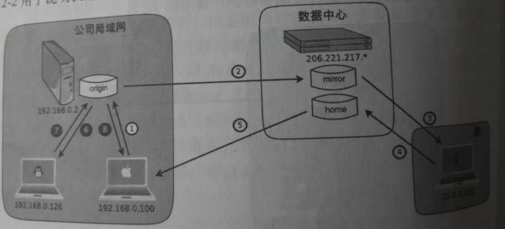

####利用Git实现异地工作协同

 

如果在家里要工作的话，首先要做的就是图中步骤③的操作：将mirror版本库中的数据同步到本地。只需要一条命令就好了：

``` $ git pull mirror master ```

然后在家里的电脑上继续工作，并提交。当准备完成一天的工作后，就执行下面的命令，相当于图中步骤④的操作：将在家中的提交推送到标记为home的版本库中。

```$ git push home ```

注：为什么还要再引入一个名为home的版本库呢？使用mirror版本库不好么？不要忘了mirror版本库只是一个镜像库，不能提供写操作。

当一早到公司，开始工作之前，先执行图中步骤⑤的操作，从home版本库将家里做的提交同步到公司的电脑中。

```$ git pull home master```

公司里的其他同事想看我的工作成果的话，可以执行图中步骤⑥操作：

```$ git pull```

一旦该同事发现我提交的内容有错误，他可以进行修改，然后推送到公司的服务器上（图中步骤⑦）。当然他的这个推送也会自动同步到外网的mirror版本库。

```$ git push```

而这个时候，我只要执行git pll操作就可以获取他对我内容的修订（步骤⑧）。 所以我的文档就一共有了6个拷贝。