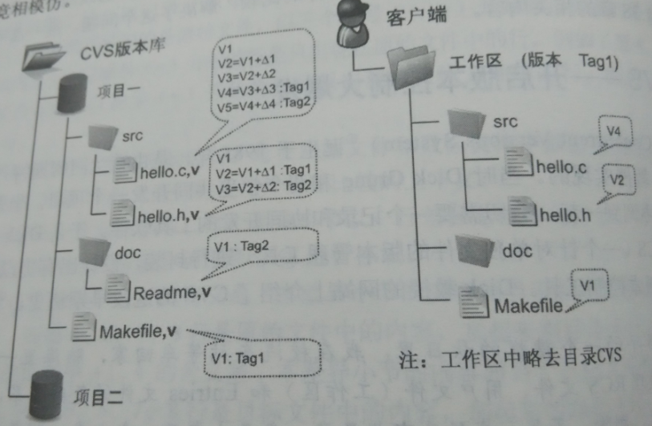

###版本控制的前世今生
#### CVS开启了版本控制大爆发。
>CVS(Concurrent Versions System)诞生于1985年，是由荷兰阿姆斯特丹VU大学的Dik Grune教授实现的。（http://www.nongnu.org/CVS/）
>
>CVS采用客户端/服务器架构设计，版本库位于服务器端，实际上也就是一个RCS文件容器。每一个RCS文件只保留一个版本的完全拷贝，其他历次更改仅将差异存储其中，使得存储变得非常有效率。
	
>CVS这种实现方式的最大好处就是简单。把版本库中任意一个目录拿出来就可以成为另外一个版本库。如果将版本库中的一个RCS文件冲命名，工作区检出的文件名也会相应地改变。这种低成本的服务器管理模式成为很多CVS粉丝至今不愿离开CVS的原因。
	
>CVS成功地为后来的版本控制系统确立了标准，像提交说明（commit log）、检入（checkin）、检出（checkout）、里程碑（tag）、分支（branch）等概念在CVS中早就已经确立。CVS的命令行格式也被后来的版本控制系统竞相模仿。
	
>CVS版本控制系统示意图
	
>>>>

>CVS的成功导致了版本控制系统的大爆发，各式各样的版本控制系统如雨后春笋般诞生了。新的版本控制系统或多或少地解决了CVS版本控制系统存在的问题。在这些版本控制系统中，最典型的就是Subversion(SVN)。