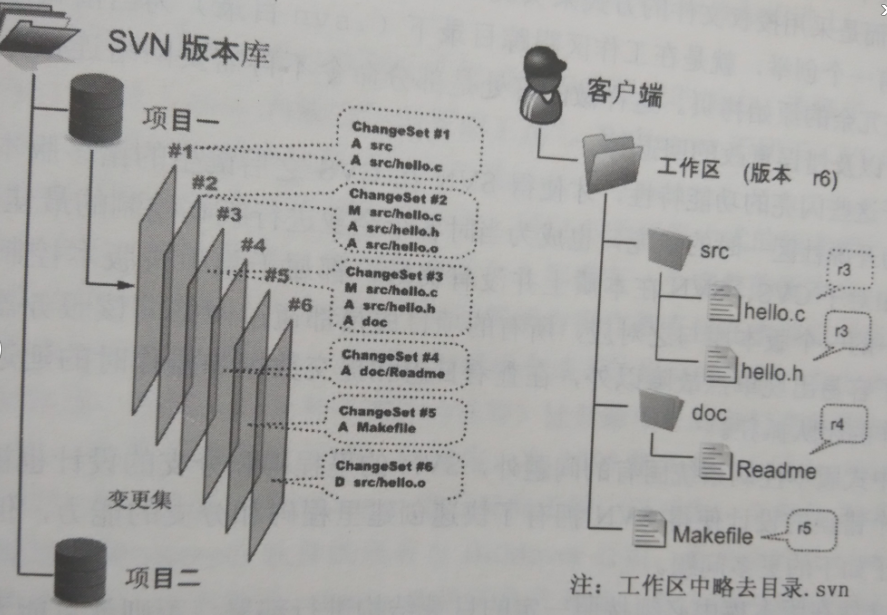

####SVN—————集中式版本控制集大成者
Subversion(参考：http://subversion.apache.org/),由于其命令行为svn，因此通常被简称为SVN。SVN由CollabNet公司于2000年资助并开始开发，目的是创建一个更好的版本控制系统以取代CVS。SVN的前期开发使用CVS做版本控制，到了2001年，SVN已经可以用于自己的版本控制了。(参考：http://svnbook.red-bean.com/en/1.5/svn.intro.whatis.html#svn.intro.history)

SVN版本控制系统示意图
>>>>

SVN的每一次提交，都会在服务器端的db/revs和db/revprops目录下各创建一个以顺序数字编号命名的文件。其中，db/revs目录下的文件（即变更集文件）记录了与上一个提交之间的差异（字母A表示新增，M表示修改，D表示删除）。在db/revprops目录下的同名文件则保存着提交日志、作者、提交时间等信息。这样设计的好处有：

* 拥有全局版本号。没提交一次SVN的版本号就会自动加1
* 实现了原子提交。SVN不会像CVS那样出现文件的部分内容被提交而其余的内容没有被提交的情况。
* 文件名不受限制。
* 文件和目录重命名也得到了支持。
* SVN还有一个创举，就是在工作区跟踪目录下(.svn目录)为当前目录中的一个文件都保存一份冗余的原始拷贝。这样做的好处是部分命令不再需要网路连接，例如文件修改的差异比较，以及错误更改的退回等。

正是由于这些闪亮的功能特性，才使得SVN在CVS之后诞生的诸多版本控制系统中脱颖而出，成为开源社区一时的新宠，也成为当时各个企业进行版本控制的最佳选择之一。

但是相对于CVS，SVN在本质上并没有突破，都属于集中式版本控制系统。即一个项目只有唯一的一个版本库与之对应，所有的项目成员都通过网络向该服务器进行提交。这样的设计除了容易出现单点故障以外，在查看日志和提交数据等操作时的延迟，会让基于广域网协同工作的团队抓狂。

除了集中式版本控制系统固有的问题外，SVN的里程碑和分支的设计也被证明是一个错误，虽然这个错误的设计使得SVN有了快速创建里程碑和分支的能力，但是这个错误的设计也导致了如下更多的问题。

* 项目文件在版本库中必须按照一定的目录结构进行部署，否则就可能无法建立里程碑和分支。
* 创建里程碑和分支会破坏精心设计的授权。
* 分支太随意从而导致混乱。
* 虽然SVN在1.5版之后拥有了合并追踪功能，但这个功能会因为混乱的分支管理而被抵消。

2009年年底，SVN由CollabNet公司交由Apache社区管理，至此SVN成为了Apache组织的一个子项目（http://en.wikipedia.org/wiki/Apache_Subversion）。这对SVN到底意味着什么？是开发的停滞？还是新的开始？结果如何我们将拭目以待。