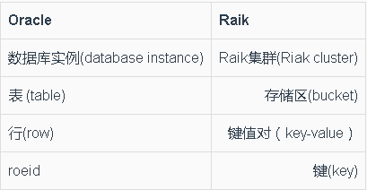

#键值数据库简介
键值数据库是最简单的NoSQL数据库。客户端可根据键查询值，设置键所对应的值，或从数据库中删除键。“值”只是数据库存储的一块数据而已，它并不关心也无需知道其中的内容；应用程序负责理解所存数据的含义。由于键值数据库总是通过主键访问，所以它们一般性能较高，且易于扩展。
##键值数据库的定义
>键值数据库（key-value store）是一张简单的哈希表，主要用在所有数据库访问均通过主键来操作的情况下。可把此表想象成传统的“关系型数据库管理系统”。
###Oracle与Raik的比较

流行的键值数据库有：

* Riak[Riak]
* Redis[Redis]
* Memcached DB及其变种[Memcached]
* Berkeley[Berkeley DB]
* Hamster[Hamster DB]
* Amazon DynamoDB
*  Voldemort

在Redis等键值数据库中，所存储的聚合不一定非要是领域对象，任何数据结构都可以。Redis能够存储list、set、hash等数据结构，而且支持“获取某个范围内的数值”（range）、“求差集”（diff）、“求并集”（union）、“求交集”（intersection）等操作。