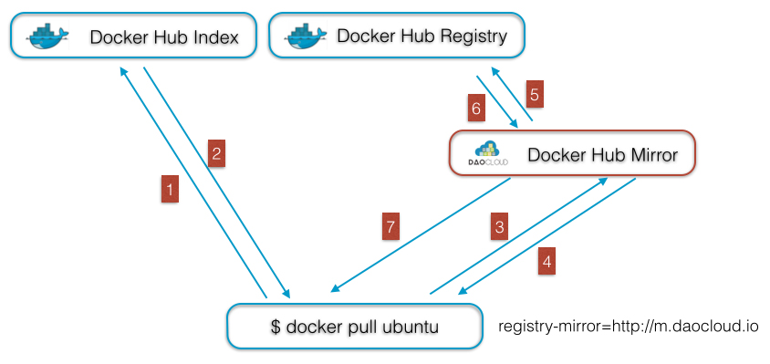

# Docker Registry

docker registry是保存images(镜像)的仓库，与之紧密联系的是docker index是保存meta data(镜像元数据)的参数，通常创建私有或公开的docker images的mirror（镜像站点）是指创建docker registry的mirror，docker index一般是不会去创建mirror的。

### 创建Docker Registry的mirror有什么用

在国内，由于复杂的网络，docker pull some_image时一般速度都很慢，并且一个组织或公司里的所有人都pull相同的image，则每次都要在互联网上传输这些image内容，又慢又浪费流量，所以国内出现了一些提供Docker Registry的mirror服务，[如daocloud](http://dockone.io/)，但这样只能解决国内pull时的速度问题，不能解决一个组织或公司里的很多人pull时浪费互联网流量问题，所以一般很多组织或公司都提供私有或公开的镜像服务以解决这两类问题。

### Docker Registry的mirror工作原理
> Docker Hub由Index和Registry构成，Index保存Image Layer的hash和关联关系等元数据（Metadata），Registry用于存储Image Layer的实际二进制数据。在客户端没有配置registry-mirror参数的情况下，每一次docker pull，客户端都会先连接Index获取元数据，然后再连接Registry获取实际的Image文件。由于Docker Hub的Index节点和Regsitry都部署国外，国内用户访问，经常遭遇连接超时或中断的情况，下载速度也极其缓慢。在启用了Mirror之后，访问流程如下：

> - 客户端的Docker Daemon连接Index获取Metadata，这一部分的数据量极小，直连国外的速度可以忍受
根据Metadata的信息，Docker Daemon与Mirror服务器建立连接。如果pull的Image在Mirror上已经有缓存，就直接在Mirror上返回地址并下载
- 如果Image在Mirror并无缓存，Mirror会与Docker Hub Registry建立连接，下载Image，提供给用户的同时，在本地缓存
- Mirror下载Docker Hub Image采用stream的方式，即可以一边下载，一边提供给客户端的Docker Daemon，不必等Image完全下载完

> 通过以上的描述，可以发现，对于常用的Image，Mirror缓存命中率会非常高，如Ubuntu等基础Image，这会极大提高下载速度。同时，Docker Image采用分层的结构，即使Image被更新，也只是下载最新一层非常少的增量数据。

> Mirror服务亦可以通过网络优化，加速对远端Docker Hub Registry的访问速度，如采用高速的商业VPN建立从Mirror到Docker Hub Registry的访问。通过七牛等云存储和CDN分发网络，会进一步提高国内客户端的下载速度。

### 怎样做Docker Registry的mirror服务

官方提供的制作做Docker Registry的mirror服务是使用[registry镜像](https://registry.hub.docker.com/_/registry/)提供的服务，目前主要有两个版本registry:latest为（0.91），和registry:2，这里称他们为v1和v2，v1和v2变化非常大(代码完全不一样)，目前v1已经不再继续开发和维护，v2只支持docker 1.6+。

v1的registry代码库为

[https://github.com/docker/docker-registry](https://github.com/docker/docker-registry)

v2的registry代码库为

[https://github.com/docker/distribution](https://github.com/docker/distribution)

目前官方对这两个版本的文档有些混乱，有的地方使用v1，有的地方使用v2

registry的主要官方文档

**v1**
- https://docs.docker.com/articles/registry_mirror/
- https://docs.docker.com/reference/api/hub_registry_spec/

**v2**
快速入门
- https://docs.docker.com/registry/
- https://docs.docker.com/registry/deploying/
详细配置参数
- https://docs.docker.com/registry/configuration/

目前网上的很多文档都是针对v1的，并且在我使用v2的过程中遇到很多问题（可参考在[这边](http://dockone.io/question/359)的讨论记录），目前先暂时用v1做mirror服务
1. 在mirror服务的主机上运行以下命令（一般使用5000端口）
```
docker run -p 5000:5000 -v /myregistrydata:/tmp/registry -e STORAGE_PATH=/tmp/registry registry
```
这样mirror上缓存的镜像就放在`/myregistrydata`目录下
2. 客户端配置docker启动参数，在`/etc/default/docker`文件中的DOCKER_OPTS中添加
```
--insecure-registry mirror_ip:5000 --registry-mirror http://mirror_ip:5000
```
    其中
    - `--insecure-registry`是为了支持HTTP，否则默认需要使用HTTPS，需要购买证书，使用自动生成的证书也可以，但需要在每个客户端上都要配置（复制domain.crt到/etc/docker/certs.d/myregistrydomain.com:5000/ca.crt）。
    - `--registry-mirror`即指向mirror镜像服务器

### v1的mirror服务架构(取自daocloud)
参考http://blog.daocloud.io/daocloud-mirror-free/



目前从官方博客上公布的数据显示目前daocloud已经缓存了超过100GB的image缓存（2015.3.29号的博客）

### 其他资料
1. [DaoCloud宣布Docker Hub Mirror服务永久免费](http://blog.daocloud.io/daocloud-mirror-free/)
2. [Docker Hub Mirror使用手册](http://dockone.io/article/160)
3. [玩转Docker镜像](http://blog.daocloud.io/how-to-master-docker-image/)
4. [Docker源码分析（九）：Docker镜像](http://blog.daocloud.io/docker-source-code-analysis-part9/)