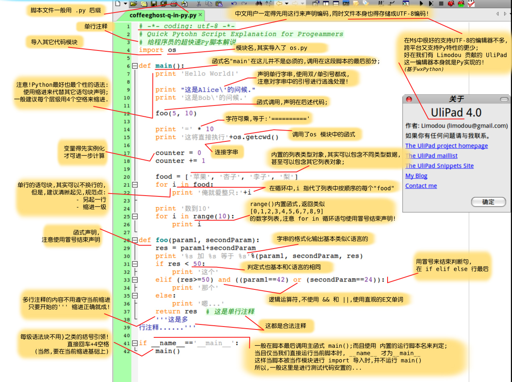

# 快速入门

### Hello world

##### 普通版

```python
#!/usr/bin/env python
# -*- coding: utf-8 -*-

def hello_world(message):
  print("Hello, ", message)

if __name__ == '__main__':
  hello_world("world")
```

##### 面向对象版

```python
#!/usr/bin/env python
# -*- coding: utf-8 -*-

class HelloWorld(object):
  def __init__(self, message):
    self.message = message

  def say_hello(self):
    print("Hello, ", self.message)

if __name__ == '__main__':
  hello = HelloWorld("world")
  hello.say_hello()
```

注释
1. **代码块**使用缩进方式，一般为2/4个空格或一个Tab，但要统一
2. 代码块开始的前一行使用"**:**"结束，如定义方法的后面，if、elif、else、while、for的后面
3. __name__为特殊的变量，如果此文件以主模块运行则__name__等于'__main__'

### 一张图让你学会Python

一张最近热门的学习快速学习Python的神图，来自[这里](http://www.open-open.com/lib/view/open1433409834354.html)

